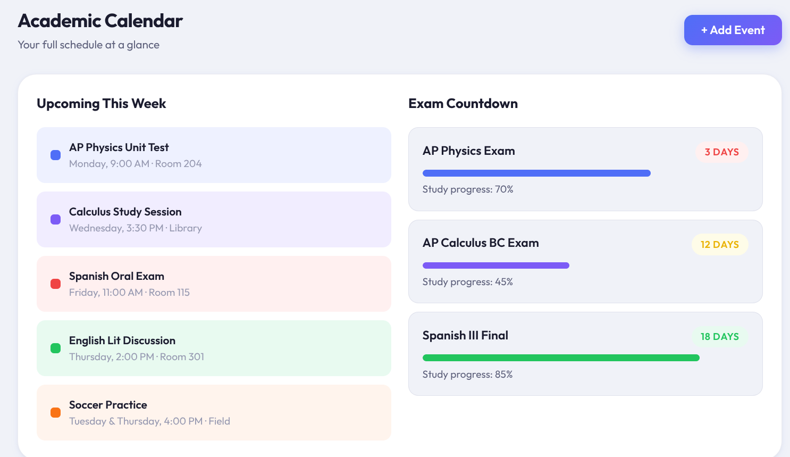

# StudyFlow-AI

StudyFlow AI is a frontend-only student productivity dashboard designed to help students organize assignments, track study habits, and improve academic efficiency through a clean and modern interface.

### Homepage


This project was created as a computer science final project and demonstrates how AI-assisted development can accelerate frontend application design while still requiring human planning, design decisions, and project direction.

---

## Overview

Students often manage assignments, notes, deadlines, and study resources across multiple disconnected platforms. StudyFlow AI centralizes these workflows into a single dashboard interface.

The platform is designed as a lightweight startup **MVP (minimum viable product)** focused on usability, accessibility, and polished UI design.

---

## Features

### Dashboard
- Overview of assignments due
- Study hours tracker
- Focus score
- Upcoming exams summary

### Task Management
- Interactive checklist for assignments
- Completion tracking

### Weekly Schedule
- Simple schedule overview with upcoming academic events


### AI Study Assistant (Simulated)
- Generate Summary
- Create Flashcards
- Make Quiz

*Note: These features use mock outputs and do not connect to real AI APIs.*

### Flashcards
- Flashcard study interface
- Flip card functionality

### Analytics
- Subject progress bars
- Study performance visualization

### Focus Section
- Daily study goal tracker
- Completed focus sessions

### Settings
- Dark mode toggle
- Notification toggle

---

## Design Goals

StudyFlow AI was designed with the following principles:

- Minimal and modern UI
- Responsive layout
- Beginner-friendly code structure
- Lightweight rendering
- Startup-style product aesthetic

Visual inspiration includes productivity platforms such as:
- Notion
- Todoist
- Academic dashboard tools

---

## Project Structure

```bash
StudyFlow-AI/
│
├── src/
│   ├── App.js
│   ├── index.js
│   └── styles.css
│
├── public/
│   └── index.html
│
├── package.json
└── README.md
